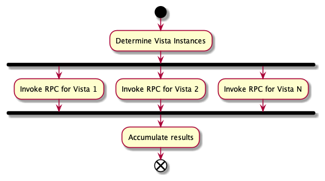

# Charon API

This Charon API provides a simplified mechanism for executing VistA RPC. The REST API allows business applications the
ability interact with VistA without the complexity of integrating EJB technology. The Charon API also provides RPC
broadcasting, allow an application to invoke an RPC across a number of VistA instances simultaneously. In particular,
the Charon API will discover relevant VistA sites for a patient.


### Why?

This approach

- Hides the EJB connection details and knowledge to a single application.
  - Business-level applications just use REST.
  - EJB is communication is difficult to mock for testing or lab use.
  - Easier to ensure EJB and JAAS practices are done correctly since they are done in only one place.
- Hides patient to vista mapping complexity.
  - Business-level services must know RPC details, but do not need to know which Vista instances specifically. They can
    simply say, "all Vistas for this patient".
  - Connection details (host, port, etc.) are encapsulated in one location, but still allows specific details to be
    optionally specified.

Note:

- Division IEN is needed and determined as station number for the VistA instance. Since the number of Vista instances is
  fixed and small, this could be "configuration" for the application. Recommendation is to place configuration in a file
  loaded at boot. The Vista connection file would be managed with deployment unit. Since Vista instances rarely change,
  this file would rarely need updates. For example:

## Invoking RPCs

Clients will invoke the Charon API by posting a request. Requests contain three pieces of information:

- **The VistA credentials.** The Charon API does not provide credentials, each application must provide their own.
- **The target vistas.** The Charon API allows clients to interact with VistA instances by name, in which case details
  such as host, port, division IEN, and network connectivity are handled by the API, or directly by specifying Vista
  coordinates.
- **The RPC details.** Clients must provide the RPC name, context, and any parameters. RPC details support macros for
  performing common, but complex tasks, such as substituting an ICN with vista site specific DNF value.
  See [Macros](macros.md)

Applications will invoke the Charon API to gather data for a particular patient. In turn, the Charon API will access
data from MPI to determine which VistA instances are likely to contain meaningful data for the patient.


#### Request structure

```
{
  principal: {
    applicationProxyUser: SOME APP PROXY, .. (Optional) Application proxy user
    accessCode: ABC123, .................... Access code
    verifyCode: XYZ987, .................... Verify code
  }
  siteSpecificPrincipals: { ................ (Optional) map of principals to be used for a specific site.
    ${site}: { <principal> },
    ${site}: { <principal> },
    ...
  }
  target: { ................................ One of forPatient or include must be specified. You may specify both.
    forPatient: 1234567890V123456,  ........ Determine appropriate VistA instances for the patient
    include: [ name, coordinates, ... ],  .. (Optional) Include these VistA instances by name and/or coordinates.
    exclude: [ name, name, ... ]  .......... (Optional) Excude these VistA instances.
  }
  rpc: {
    name: SOME RPC NAME
    context: SOME CONTEXT
    parameters: [   ........................ Optional list of string, reference, or array type parameters
      { string: value },
      { ref: reference },
      { array: [ value, value, ... ] },
      { namedArray: { key: value, key: value, ... }
    ]
  }
}
```

- `siteSpecificPrincipals` can be used to override the principals to be used at a specific site. The default `principal`
  will be used for each site unless a specific entry is provided. For example, consider a request that is made
  against `605`, `673`, and `488`. If the `siteSpecificPrincipals` is provided with an entry for `605`. The
  default `principal` would be used for `673` and `488`, but site specific principal would be used for `605`. This
  capability is intented to support situations where users are in transition at specific sites. For example, users are
  in the process of being created or their credentials are being changed at different sites.
  ```
  {
  "principal": {
    "accessCode": "ABCD"
    "verifyCode": "XYZ"
  },
  "siteSpecificPrincipals": {
    "605": {
      "applicationProxyUser": "AWE SOME PROXY",
      "accessCode": "1234"
      "verifyCode": "5678"
    }
  },
  ```
- Vista `coordinates` are specified as `host:port:divisionIen:timezoneId`. For
  example, `10.11.12.123:18123:456:America/New_York`. See https://en.wikipedia.org/wiki/List_of_tz_database_time_zones
  for time zone IDs.

#### Response structure

```
{
   status: OK|FAILED .................. Result will be FAILED if any part of the request failed
   message: optional message
   results: [  ........................ Potentially empty if no RPCs were actually invoked
     {
       vista: name,
       response: <payload>,  .......... Whatever the RPC payload is
       error: message  ................ Specified if call failed
     },
     ...
   ]
}
```

HTTP Status

- `200` if call is successful.
- `400` if any RPC fails.
- `401` if login fails.
- `403` if any RPC is not available to the RPC context.
  > This error is detected by response: `Code: '182006'; Type: 'VPR GET PATIENT DATA JSON'; Message: 'The remote procedure VPR GET PATIENT DATA JSON is not registered to the option XOBV VISTALINK TESTER.'`
- `408` if any RPC times out.
- `500` if MPI call fails or unexpected errors occur.

### Charon "invoke RPC" flow

Charon will determine the VistA instances to involve in the request based on the `target`
specification of the request. VistA instances will be invoked in parallel.



#### Determining Vista instances

- The requester may have specified explicit Vista instances to include in the RPC, or they may have specified a patient
  ICN, or both.
- If a patient ICN is provided, then the Vista instances will need to be determined based on patient activity using the
  Master Person Index.
- If a patient ICN is provided, a requester may explicitly exclude a Vista instances. This allows then to ask "Invoke
  this RPC using every Vista the patient has visited except these."


## Under the hood

The Charon API isolates the details of interacting with VistA to just a couple of classes. This approach allows for
easier testing and a separation of concerns.


### Configuration

Configuration is managed per environment and deployed with the Charon API. You may inspect the configuration using by
invoking `GET ${charon-url}/rpc/connections`

```
{
  vistas: [
    { name: lomalinda, host: loma-linda.med.va.gov, port: 18105, divisionIen: 605 },
    ...
  ]
}
```

## Authorization status support

Charon supports a special API for some authorization use cases. See [Authorization Status](authorization-status.md) for
details.

## Testing considerations

VistaLink EJB technology is very difficult to mock when compared to REST or SOAP or other HTTP-based communication. Mock
integration testing will be skipped. Unit tests and live integration tests will be required to validate functionality.

To support synthetic environments, a Mock Charon API will be created, similar to Mock EE. This mock implementation will
have canned responses based on RPC requests.

## Manually testing RPCs.

The Charon API provides a test image that can be used for ad-hoc testing of RPCs. There are two Docker-based techniques

#### `charon-tests/test-request-file`

- Recommended technique
- Specify Charon RPC request as a file
- Supports all Charon authentication mechanism
- But, requires Vista targets to be specifed as `include: [ coordinates ]`.

#### Manually running `VistalinkRpcInvokerTest`

- Supports Access/Verify code based authentication
- Request can specified using environment variables
- But, has awkward environments

```
docker run --rm --env-file vista.env vasdvp/lighthouse-charon-tests:latest run --module-name charon-tests --test-pattern '.*VistalinkRpcInvokerTest'
```

You must specify a series of environment variables, which can be provided as a Docker envfile

`vista.env`

```
K8S_LOAD_BALANCER=host.docker.internal
K8S_ENVIRONMENT=local
SENTINEL_ENV=local
CLIENT_KEY=hello
TEST_RPCINVOKER=true
VISTA_ACCESS_CODE=SOME$CODE
VISTA_VERIFY_CODE=1234$5678
VISTA_HOST=host.docker.internal
VISTA_PORT=8000
VISTA_DIVISION_IEN=605

#VISTA_RPC={"context":"XOBV VISTALINK TESTER","name":"XOBV TEST PING"}
#VISTA_RPC={"context":"XOBV VISTALINK TESTER","name":"XOBV TEST STRING","parameters":[{"string":"shanktopus"}]}
#VISTA_RPC={"context":"XOBV VISTALINK TESTER","name":"XOBV TEST GLOBAL ARRAY","parameters":[{"array":["go","shanktopus"]}]}
#VISTA_RPC={"context":"XOBV VISTALINK TESTER","name":"XOBV TEST LOCAL ARRAY","parameters":[{"array":["go","shanktopus"]}]}
#VISTA_RPC={"name":"VAFCTFU CONVERT DFN TO ICN","context":"VAFCTF RPC CALLS","parameters":[{"string":"100848"}]}
VISTA_RPC={"name":"VPR GET PATIENT DATA JSON","context":"VPR APPLICATION PROXY","parameters":[{"namedArray":{"patientId":"100848","domain":"document","text":"1","start":"","stop":"","max":"","id":"","uid":""}}]}
```

`VISTA_RPC` matches the `rpc` structure of the Charon API request.

> `K8S_LOAD_BALANCER` and `VISTA_HOST` use `host.docker.internal` on Windows and Mac.
> Use `localhost` on Linux.
> See https://docs.docker.com/docker-for-mac/networking/#use-cases-and-workarounds
