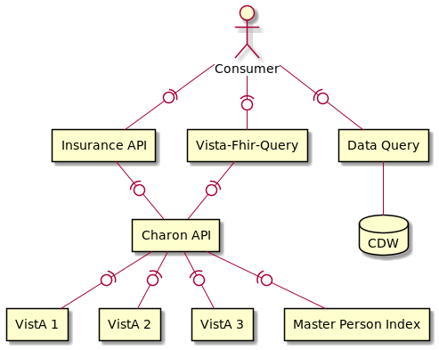

# Vistalink API

This Vistalink API provides a simplified mechanism for executing VistA RPC. The REST API allows business applications the ability interact with VistA without the complexity of integrating EJB technology. The Vistalink API also provides RPC broadcasting, allow an application to invoke an RPC across a number of VistA instances simultaneously.  In particular, the Vistalink API will discover relevant VistA sites for a patient.



### Why?
This approach
- Hides the EJB connection details and knowledge to a single application. 
  - Business-level applications just use REST.
  - EJB is communication is difficult to mock for testing or lab use.
  - Easier to ensure EJB and JAAS practices are done correctly since they are done in only one place.
- Hides patient to vista mapping complexity. 
  - Business-level services must know RPC details, but do not need to know which Vista instances specifically. They can simply say, "all Vistas for this patient". 
  - Connection details (host, port, etc.) are encapsulated in one location.

Note:
- Division IEN is needed and determined as station number for the VistA instance. Since the number of Vista instances is fixed and small, this could be "configuration" for the application. Recommendation is to place configuration in a file loaded at boot. The Vista connection file would be managed with deployment unit. Since Vista instances rarely change, this file would rarely need updates. For example:


## Invoking RPCs
Clients will invoke the Vistalink API by posting a request. Requests contain three pieces of information:
- **The VistA credentials.** The Vistalink API does not provide credentials, each application must provide their own.
- **The target vistas.** The Vistalink API allows clients to interact with VistA instances by name. Details such as host, port, division IEN, and network connectivity are handled by the API.
- **The RPC details.** Clients must provide the RPC name, context, and any parameters.

#### Request structure
```
{
  principal: {
    apiKey: ABC123,
    verificationKey: XYZ987,
  }
  target: {
    forPatient: 1234567890V123456,  ──┬─ one of
    include: [ name, name, ... ],  ───┘
    exclude: [ name, name, ... ]  ────── optional if forPatient is specified
  }
  rpc: {
    name: SOME RPC NAME
    context: SOME CONTEXT
    parameters: [   ──────────────────── optional list of string, reference,
      { string: value },                   or array type parameters. 
      { ref: reference },
      { array: [ value, value, ... ] } 
    ]
  }
}
```
#### Response structure
```
{
   status: OK|FAILED ─────────────────── Result will be FAILED if any part of the request failed
   message: optional message
   results: [  ───────────────────────── Potentially empty if no RPCs were actually invoked  
     {
       vista: name,
       response: <payload>,  ─────────── whatever the RPC payload is 
       error: message  ───────────────── specified if call failed
     },
     ... 
   ]
}
```
HTTP Status
- `200` if call is successful.
- `400` if any RPC fails.
- `401` if login fails.
- `403` if any RPC is not available to the RPC context.  
  > This error is detected by response: `Code: '182006'; Type: 'VPR GET PATIENT DATA JSON'; Message: 'The remote procedure VPR GET PATIENT DATA JSON is not registered to the option XOBV VISTALINK TESTER.'`
- `408` if any RPC times out.
- `500` if MPI call fails or unexpected errors occur.


### Vistalink "invoke RPC" flow
The Vistalink API will determine the VistA instances to involve in the request based on the `target` specification of the request. VistA instances will be invoked in parallel.


#### Determining Vista instances
- The requester may have specified explicit Vista instances to include in the RPC, or they may have specified a patient ICN, or both. 
- If a patient ICN is provided, then the Vista instances will need to be determined based on patient activity using the Master Person Index.
- If a patient ICN is provided, a requester may explicitly exclude a Vista instances. This allows then to ask "Invoke this RPC using every Vista the patient has visited except these."


## Under the hood
The Vistalink isolates the details of interacting with VistA to just a couple of classes. This approach allows for easier testing and a separation of concerns.


### Configuration
Configuration is managed per environment and deployed with the Vistalink API. You may inspect the configuration using by invoking `GET ${vistalink-url}/rpc/connections` 
```
{
  vistas: [
    { name: lomalinda, host: loma-linda.med.va.gov, port: 18105, divisionEin: 605 },
    ...
  ]
}
```


## Testing considerations
VistaLink EJB technology is very difficult to mock when compared to REST or SOAP or other HTTP-based communication. Mock integration testing will be skipped. Unit tests and live integration tests will be required to validate functionality.

To support synthetic environments, a Mock Vistalink API will be created, similar to Mock EE. This mock implementation will have canned responses based on RPC requests. 
